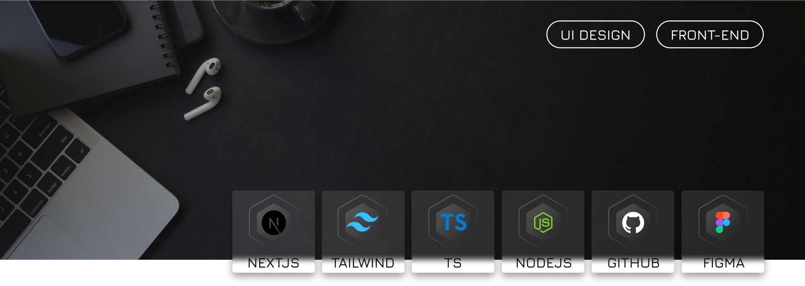
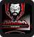
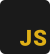
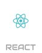
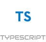
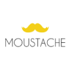

# 👋 <b>[Diogo Realles 🡽](https://www.linkedin.com/in/diogorealles)</b>
### <b>Desenvolvedor Web Front-end</b> | <b>UI Designer</b>
 

<!--

-->

## <b>Sobre mim</b>
Desenvolvi e entreguei projetos como  
landing pages para <b>Level Up! Games</b> | <b>TBNet - Grupo TecBan</b> | <b>Trisul</b> | <b>Setin</b> | com alto score de <b>SEO</b>, <b>Acessibilidade</b> e <b>Boas Práticas.</b>
<!--
### <b>Front-end</b>
 <b>- HTML Semântico</b>  
 <b>- SEO Otimizado</b> | Google Analytics 4  
 <b>- Acessibilidade</b>  
 -->
  

  
  
  
  
  

  
  
  
  
  

 
<!--
### <b>UI Design</b>
 <b>- Tipografia | Teoria das cores | Grids | Componentes & Variantes.</b>  
 <b>- Wireframe:</b> Baixa fidelidade e Alta fidelidade.  
 <b>- Prototipação:</b> Protótipos interativos.  
 <b>- Styleguide:</b> Tipografia | Estados dos componentes | Paleta de cores | Grids | Tokens  
 -->
 
 

   
 

<!-- 
## <b>Cursos e Projetos</b>
<table>
  <thead>
    <tr>
      <th>Curso / Projetos</th>
      <th>Descrição</th>
      <th>Ver mais</th>
    </tr>
  </thead>

  <tbody>
    <tr>
      <td>

      </td>
      <td>
        <b>[B7Web](https://github.com/DiogoRealles/course-projects)</b> 
        Curso de Front-end e Web Design.
      </td>
      <td>
        <b>[B7Web](https://github.com/DiogoRealles/course-projects)</b> 
      </td>
    </tr>
    <tr>
      <td>

      </td>
      <td>
        <b>[Origamid](https://github.com/DiogoRealles/courses/tree/develop/origamid)</b> 
        Curso de Front-end e Web Design.
      </td>
      <td>
        <b>[Origamid](https://github.com/DiogoRealles/courses/tree/develop/origamid)</b> 
      </td>
    </tr>
    <tr>
      <td>

      </td>
      <td>
        <b>[Rocketseat](https://github.com/DiogoRealles/courses/tree/develop/rocketseat)</b> 
        Plataforma completa de aprendizado contínuo em programação.
      </td>
      <td>
        <b>[Rocketseat](https://github.com/DiogoRealles/courses/tree/develop/rocketseat)</b> 
      </td>
    </tr>
    <tr>
      <td>

      </td>
      <td>
        <b>[Matheus Battisti](https://github.com/DiogoRealles/courses/tree/develop/hora-de-codar)</b> 
        Capacitar quem deseja ser desenvolvedor/programador para o mercado de trabalho.
      </td>
      <td>
        <b>[Matheus Battisti](https://github.com/DiogoRealles/courses/tree/develop/hora-de-codar)</b> 
      </td>
    </tr>
    <tr>
      <td>

      </td>
      <td>
        <b>[Projetos](https://github.com/DiogoRealles/courses/tree/develop/projects)</b> 
        Meus projetos pessoais, redesign de layouts.
      </td>
      <td>
        <b>[Projetos](https://github.com/DiogoRealles/courses/tree/develop/projects)</b> 
      </td>
    </tr>
  </tbody>
</table>
   

-->
<!-- 
## <b>Linguagens e Ferramentas</b>:

 
  
   &nbsp;
   &nbsp;
   &nbsp;
   &nbsp;
   &nbsp;
   &nbsp;
   &nbsp;
   &nbsp;
   &nbsp;
   &nbsp;
   &nbsp;

 

-->

 
 # <b>Experiências</b>

 Minhas experiências de trabalho mais recente:
 
 
 
 **Front-end.** 
 [**id360 New Media**](https://www.id360.com.br/) • 2023 - Atualmente | Full-time
 
 Linguagens & Tecnologias: 
  
  
  
  
  
  
  
  
 
 Projetos em destaque: <b>[Omini - Studio 27](https://lp-studio27.vercel.app/) | [Quinta da Baroneza](https://planodiretor-baroneza.vercel.app/) | [Reserva Terrara](https://www.reservaterrara.com.br/) | [Boulevard - Vila Romana](https://www.boulevardvilaromana.com.br/)</b> 
 Como 𝗱𝗲𝘀𝗲𝗻𝘃𝗼𝗹𝘃𝗲𝗱𝗼𝗿 𝘄𝗲𝗯 𝗙𝗿𝗼𝗻𝘁-𝗲𝗻𝗱, sou responsável pelo desenvolvimento e entrega de projetos nas tecnologias: 𝗛𝗧𝗠𝗟 𝗖𝗦𝗦 𝗦𝗔𝗦𝗦 𝗝𝗮𝘃𝗮𝗦𝗰𝗿𝗶𝗽𝘁 𝗡𝗲𝘅𝘁𝗝𝗦𝟭𝟯 𝗧𝗮𝗶𝗹𝘄𝗶𝗻𝗱𝗖𝗦𝗦
  

Utilizando ferramentas de interfaces como 𝗙𝗶𝗴𝗺𝗮 𝗔𝗱𝗼𝗯𝗲-𝗫𝗗 e para avaliação dos layouts. 
Assegurando um fluxo constante de entregas com 𝗠𝗲𝗹𝗵𝗼𝗿𝗲𝘀 𝗣𝗿𝗮́𝘁𝗶𝗰𝗮𝘀 de código e alto nível de 𝗣𝗲𝗿𝗳𝗼𝗿𝗺𝗮𝗻𝗰𝗲 e 𝗦𝗘𝗢 e 𝗔𝗰𝗲𝘀𝘀𝗶𝗯𝗶𝗹𝗶𝗱𝗮𝗱𝗲. 
 
Utilizando conceitos de gitflow com versionamento de códigos com 𝗚𝗶𝘁 e 𝗚𝗶𝘁𝗵𝘂𝗯/𝗕𝗶𝘁𝗯𝘂𝗰𝗸𝗲𝘁. 
Fui destacado a participar de projetos de grandes clientes como: Setin, Archote, Trisul e outros. 
Minha facilidade de comunicação e conhecimentos e habilidades multidisciplinares em 𝗨𝗜 𝗗𝗲𝘀𝗶𝗴𝗻 e 𝗕𝗮𝗰𝗸-𝗲𝗻𝗱 me permitiram auxiliar e trabalhar e cooperar com equipe de Designer e Back-end e a supervisão de QA para garantir a qualidade das interfaces, experiência e usabilidade do usuário. 
    
 
 
 
 **Front-end.** 
 [**Agência Moustache**](https://www.br.leveluplatam.com/marketing/) • 2022 - 2023 | Full-time
 
 Linguagens & Tecnologias: 
  
  
  
  
  
  
  
  
 
 Projetos em destaque: <b>[Level Up! Games](https://br.leveluplatam.com/marketing/) | [TBNet - Grupo TecBan](https://www.tbnet.com.br/)</b>  
 Como 𝗱𝗲𝘀𝗲𝗻𝘃𝗼𝗹𝘃𝗲𝗱𝗼𝗿 𝘄𝗲𝗯 𝗙𝗿𝗼𝗻𝘁-𝗲𝗻𝗱, fui responsável pelo desenvolvimento e entrega de projetos nas tecnologias: 𝗛𝗧𝗠𝗟 𝗖𝗦𝗦 𝗦𝗔𝗦𝗦 𝗝𝗮𝘃𝗮𝗦𝗰𝗿𝗶𝗽𝘁 𝗕𝗼𝗼𝘁𝘀𝘁𝗿𝗮𝗽 𝗷𝗤𝘂𝗲𝗿𝘆 𝗪𝗼𝗿𝗱𝗣𝗿𝗲𝘀𝘀. 
Utilizando ferramentas de interfaces como 𝗙𝗶𝗴𝗺𝗮 𝗔𝗱𝗼𝗯𝗲-𝗫𝗗 e 𝗣𝗵𝗼𝘁𝗼𝘀𝗵𝗼𝗽 para avaliação dos layouts. 
Assegurando um fluxo constante de entregas com 𝗠𝗲𝗹𝗵𝗼𝗿𝗲𝘀 𝗣𝗿𝗮́𝘁𝗶𝗰𝗮𝘀 de código e alto nível de 𝗣𝗲𝗿𝗳𝗼𝗿𝗺𝗮𝗻𝗰𝗲 e 𝗦𝗘𝗢 e 𝗔𝗰𝗲𝘀𝘀𝗶𝗯𝗶𝗹𝗶𝗱𝗮𝗱𝗲. 
 
Utilizando conceitos de gitflow com versionamento de códigos com 𝗚𝗶𝘁 e 𝗚𝗶𝘁𝗵𝘂𝗯/𝗕𝗶𝘁𝗯𝘂𝗰𝗸𝗲𝘁. 
Fui destacado a participar de projetos de grandes clientes como: Level Up! Games, TBNet, APMP e outros. 
Minha facilidade de comunicação e conhecimentos e habilidades multidisciplinares em 𝗨𝗜 𝗗𝗲𝘀𝗶𝗴𝗻 e 𝗕𝗮𝗰𝗸-𝗲𝗻𝗱 me permitiram auxiliar e trabalhar e cooperar com equipe de Designer e Back-end e a supervisão de QA para garantir a qualidade das interfaces, experiência e usabilidade do usuário. 
    
 
 
 
 **Front-end.** 
 [**GMMTI**](https://www.gmmti.com.br/) • 2019 - 2021 | Full-time
 
 Linguagens & Tecnologias: 
  
  
  
  
  
  
 Projetos em destaque: <b>[Website](https://www.gmmti.com.br/)</b>  
 - Participação na criação do novo site da empresa com as tecnologias 𝗛𝗧𝗠𝗟𝟱 𝗖𝗦𝗦𝟯 𝗦𝗔𝗦𝗦 𝗝𝗔𝗩𝗔𝗦𝗖𝗥𝗜𝗣𝗧 𝗲 𝗕𝗢𝗢𝗧𝗦𝗧𝗥𝗔𝗣𝟱. Aplicando 𝗠𝗲𝗹𝗵𝗼𝗿𝗲𝘀 𝗣𝗿𝗮́𝘁𝗶𝗰𝗮𝘀 para o melhor 𝗦𝗘𝗢 𝗔𝗰𝗲𝘀𝘀𝗶𝗯𝗶𝗹𝗶𝗱𝗮𝗱𝗲 e 𝗣𝗲𝗿𝗳𝗼𝗺𝗮𝗻𝗰𝗲 do projeto. 
Utilizando conceitos de gitflow para versionamento do projeto com as tecnologias 𝗚𝗶𝘁 e 𝗚𝗶𝘁𝗵𝘂𝗯. 
Ganhando e expandindo experiências sobre 𝗙𝗿𝗼𝗻𝘁-𝗲𝗻𝗱 e 𝗨𝗜 𝗗𝗲𝘀𝗶𝗴𝗻. 
- Elaborando e desenvolvendo layouts com a brand e conceito das empresas. 
- Codificação dos layouts nas tecnologias: 𝗛𝗧𝗠𝗟 𝗖𝗦𝗦 𝗦𝗔𝗦𝗦 𝗝𝗮𝘃𝗮𝗦𝗰𝗿𝗶𝗽𝘁 𝗕𝗼𝗼𝘁𝘀𝘁𝗿𝗮𝗽. 
- Colaboração com o time de back-end. 
    

## <b>Contate-me</b>

  <!--  &nbsp;
   &nbsp;
   &nbsp; /-->
   &nbsp;
   &nbsp;

