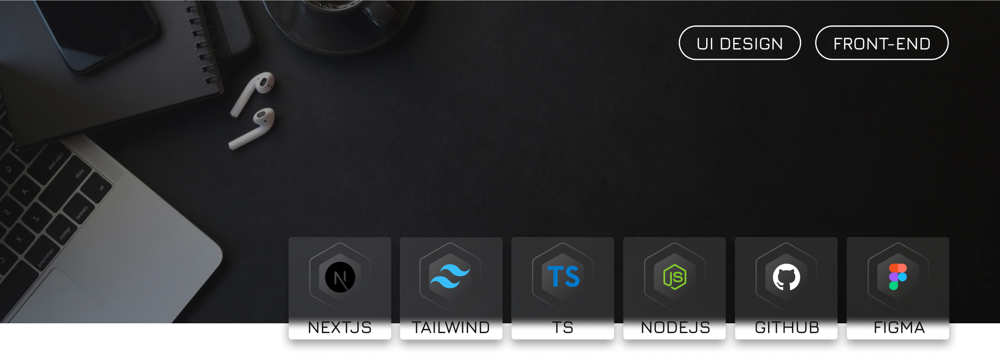
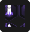
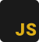

# <b>[Diogo Realles 🡽](https://facebook.com/softwarealles)</b>
<b>Front-end Jr.</b> 
<b>UI Designer Jr.</b>
   

## <b>Sobre mim</b>
<b>Front-end</b> 
Estudando REACT - TYPESCRIPT - ES6+ (Projetos de cursos). 
Conhecimentos em JavaScript - HTML - CSS (SASS / BEM) (Projetos próprios). 

<b>UI Design</b> 
Tipografia - Teoria das cores 
Componentes e Variantes. 
Wireframe: Baixa fidelidade e Alta fidelidade. 
Prototipação: Baixa fidelidade e Alta fidelidade 
Protótipos interativos 
Ferramentas: (Figma / Adobe-XD). 

Procuro aplicar boas práticas de acessibilidade e semântica nos projetos.

<b>

  _Quanto mais suar no treino, menos sangrará no campo de batalha!_

</b>
   

## <b>Cursos e Projetos</b>
<table>
  <thead>
    <tr>
      <th>Curso / Projetos</th>
      <th>Descrição</th>
      <th>Ver mais</th>
    </tr>
  </thead>

  <tbody>
    <tr>
      <td>

      </td>
      <td>
        <b>[Origamid](https://github.com/DiogoRealles/courses/tree/develop/origamid)</b> 
        Curso de Front-end e Web Design.
      </td>
      <td>
        <b>[Origamid](https://github.com/DiogoRealles/courses/tree/develop/origamid)</b> 
      </td>
    </tr>
    <tr>
      <td>

      </td>
      <td>
        <b>[Rocketseat](https://github.com/DiogoRealles/courses/tree/develop/rocketseat)</b> 
        Plataforma completa de aprendizado contínuo em programação.
      </td>
      <td>
        <b>[Rocketseat](https://github.com/DiogoRealles/courses/tree/develop/rocketseat)</b> 
      </td>
    </tr>
    <tr>
      <td>

      </td>
      <td>
        <b>[Matheus Battisti](https://github.com/DiogoRealles/courses/tree/develop/hora-de-codar)</b> 
        Capacitar quem deseja ser desenvolvedor/programador para o mercado de trabalho.
      </td>
      <td>
        <b>[Matheus Battisti](https://github.com/DiogoRealles/courses/tree/develop/hora-de-codar)</b> 
      </td>
    </tr>
    <tr>
      <td>

      </td>
      <td>
        <b>[Projetos](https://github.com/DiogoRealles/courses/tree/develop/projects)</b> 
        Meus projetos pessoais, redesign de layouts.
      </td>
      <td>
        <b>[Projetos](https://github.com/DiogoRealles/courses/tree/develop/projects)</b> 
      </td>
    </tr>
  </tbody>
</table>
   

## <b>Conhecimento / Linguagens e Ferramentas</b>:

 

   &nbsp;
   &nbsp;
   &nbsp;
   &nbsp;
   &nbsp;
   &nbsp;
   &nbsp;
   &nbsp;
   &nbsp;
   &nbsp;
   &nbsp;
   &nbsp;
   &nbsp;

   

## <b>Estou Estudando:</b>

 

   &nbsp;
   &nbsp;
   &nbsp;
   &nbsp;

   

## <b>Tenho Interesse: </b>

 

   &nbsp;
   &nbsp;
   &nbsp;

   

## <b>Laboratório de Testes</b>

Aqui é aonde faço meus experimentos e afio minhas skills

|           Hospedagem          |                             Projetos                         |
|                -              |                              -                               |
|  | <b>[Codepen 🡽](https://codepen.io/SoftwaRealles)      </b>  |
|    | <b>[Replit 🡽](https://replit.com/@softwarealles/)     </b>  |
|  | <b>[Behance 🡽](https://www.behance.net/softwarealles/)</b>  |
   

## <b>Contate-me</b>

   &nbsp;
   &nbsp;
   &nbsp;
   &nbsp;
   &nbsp;

   
